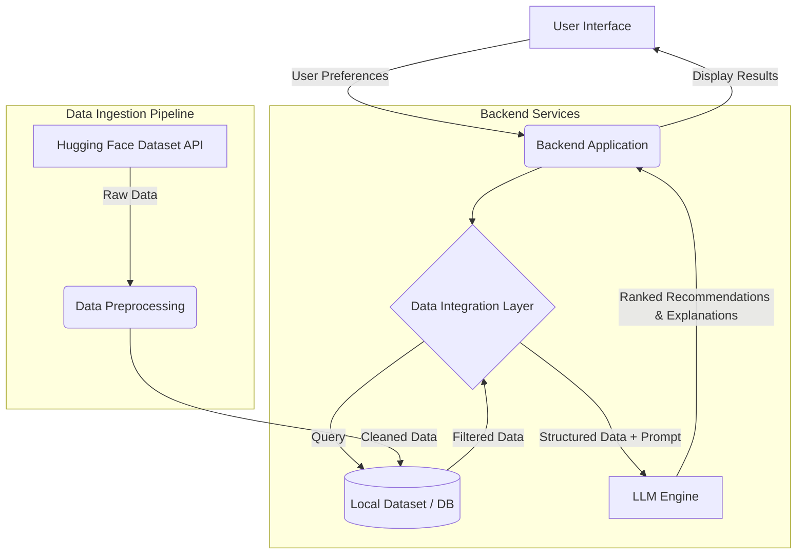

# System Architecture: AI-Powered Restaurant Recommendation System

This document outlines the high-level architecture and data flow for the AI-Powered Restaurant Recommendation System based on the Zomato Use Case.

## 1. High-Level Architecture Diagram

## 2. Component Breakdown

### 2.1 User Interface (UI / Frontend)
- **Role:** Collects user preferences and displays the final recommendations.
- **Inputs:** Location, Budget, Cuisine, Minimum Rating, and other preferences (e.g., family-friendly).
- **Outputs:** Displays the recommended restaurant names, cuisines, ratings, estimated costs, and personalized AI-generated explanations.
- **Tech Stack Options:** Streamlit, Gradio, React, or a simple HTML/CSS/JS web app.

### 2.2 Data Ingestion Pipeline
- **Role:** Fetches and preprocesses the raw dataset to ensure it is clean and ready for querying.
- **Source:** Hugging Face dataset (`ManikaSaini/zomato-restaurant-recommendation`).
- **Processing Steps:**
  - Downloading CSV/JSON data.
  - Data cleaning (handling missing values, standardizing formats).
  - Extracting relevant fields (Restaurant Name, Location, Cuisine, Cost, Rating).
  - Storing the cleaned data locally (e.g., in a Pandas DataFrame, SQLite, or a Vector Database for advanced retrieval).

### 2.3 Data Integration Layer (Backend)
- **Role:** Acts as the bridge between user inputs, the database, and the LLM.
- **Workflow:**
  1. **Filtering:** Applies hard filters on the dataset based on user preferences (e.g., Location == 'Delhi', Rating >= 4.0, Budget == 'medium').
  2. **Prompt Engineering:** Constructs a dynamic prompt incorporating the user's specific context and the filtered restaurant candidates.

### 2.4 LLM Recommendation Engine
- **Role:** Provides the "AI" intelligence by analyzing the filtered candidates and reasoning about which options best suit the user's nuanced preferences.
- **Tasks:**
  - Ranks the filtered restaurants based on the prompt's instructions.
  - Generates human-like, personalized explanations justifying why each restaurant is a good fit.
  - Summarizes the final choices.
- **Integration:** Groq API for ultra-fast, low-latency LLM inference.

## 3. Data Flow

1. **Initialization:** At application startup, the Data Ingestion Pipeline loads the Zomato dataset into memory or a local database.
2. **Input Capture:** The user submits their dining preferences via the UI.
3. **Pre-filtering:** The Backend queries the dataset to retrieve a subset of restaurants that strictly match the user's location, budget, and baseline rating.
4. **LLM Processing:** The filtered list, along with the user's exact preferences, is injected into a well-crafted prompt and sent to the LLM.
5. **Generation:** The LLM returns structured output containing ranked recommendations and text explanations.
6. **Delivery:** The Backend parses the LLM output and sends it to the UI for display.

## 4. Scalability and Future Enhancements
- **Vector Search (RAG):** Instead of simple filtering, convert restaurant reviews and descriptions into embeddings, using a Vector Database (like ChromaDB or Pinecone) for semantic similarity search.
- **Caching:** Cache frequent requests (e.g., "Best high-rated Chinese in Delhi") to reduce LLM API calls and latency.
- **User Profiles:** Implement a database to store historical user preferences for continuously improving personalized recommendations.
